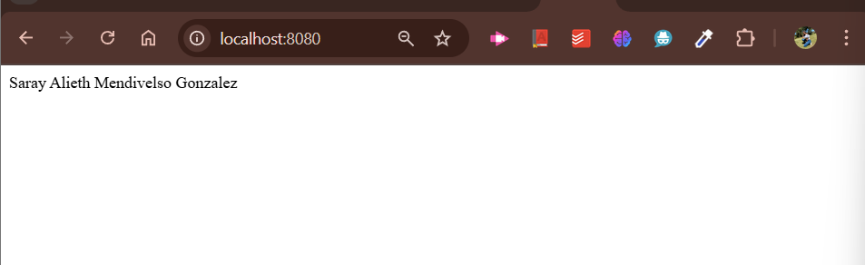

# Name REST API - Spring Boot & Java

### 💡Descripción del Proyecto
Este proyecto es una **API REST** muy sencilla que retorna el nombre 
de la autora utilizando **Spring Boot** y **Java**. La aplicación 
expone un endpoint principal que, al ser consultado, devuelve el texto:
```sh
Saray Alieth Mendivelso Gonzalez
```
### 📚 Componentes del Proyecto
- **NameController**  
  Controlador REST que expone el endpoint raíz (`"/"`) y retorna el nombre de la autora al realizar una petición GET.

- **RailwayApp**  
  Clase principal con el método `main` que inicia la aplicación Spring Boot.

----------------------
### 📍Características
- Implementado con **Spring Boot** y **Java**
- Fácil de entender
- Ideal como base para desplegar en **Railway.app** u otras plataformas


-------------------- 

### 🔧 Prerrequisitos
Antes de instalar y ejecutar el proyecto, asegúrate de tener instalado:
- **Java 17**
- **Maven**
- **Git**
- **IDE recomendado:** IntelliJ IDEA o Eclipse
-
------------------- 
### ⚙️Instalación
Para clonar y configurar el proyecto en tu máquina local:

**1. Clona el repositorio:**
```sh
git clone https://github.com/saraygonm/IETI-Railway-name.git
 ```

**2. Entra en el directorio del proyecto**
```sh
cd IETI-Railway-name
```

**3. Para construir y ejecutar la aplicación:**
```sh
mvn mvn clean install  
mvn spring-boot:run
```
Esto iniciará el servidor en `http://localhost:8080`.

<p align="center">
  
</p>


### 📉 Uso del Endpoint
Para obtener la cadena con tu nombre, realiza una solicitud GET al endpoint raíz:
```sh
GET http://localhost:8080/
```
La respuesta será:
```sh
Saray Alieth Mendivelso Gonzalez

```

------------------- 
### 🛠️ Construido con
- **Spring Boot** - Framework para aplicaciones Java
- **Java** - Lenguaje de programación


------------------- 

### 👩🏼‍💻 Autora
**Saray Alieth Mendivelso Gonzalez**